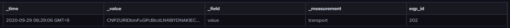
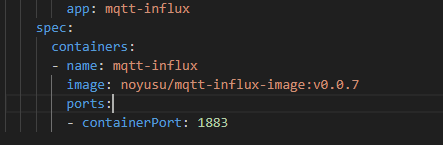

# mqtt-influxdb-connector
이 프로젝트는 MQTT 메시지를 읽고, (선택적으로 Protobuf를 사용하여) 디코딩한 다음, 데이터를 InfluxDB 인스턴스에 쓰는 Python 기반 telegraf 에뮬레이터입니다. 이 에뮬레이터는 Kubernetes 환경에서 실행되도록 설계되었습니다.

## Table of Contents

- [Background](#background)
- [Directory Structure](#directory-structure)
- [Installation](#installation)
- [Usage](#usage)
- [Configuration](#configuration)
- [Dependencies](#dependencies)
- [Docker](#docker)
- [Kubernetes Deployment](#kubernetes-deployment)
- [Protobuf](#protobuf)


## Background

초기에는 `telegraf`를 써서 MQTT - InfluxDB 사이의 Connector 모듈을 구성하려고 했지만,
데이터 write하는데 있어서 세부적인 조정(payload - field 1:1 / tag 커스텀 / paylod 내부의 timestamp 이용하여 Point설정 등)이 어려워 직접 구현하고자 하였음.


위와 같이 _time과 recoed데이터를 담은 한쌍의 field쌍과, tag key,value, measurement를 직접 커스텀하기 위함.

## Directory Structure
```plaintext
.../mqtt-influxdb-connector/
├── config.yaml
├── Dockerfile
├── hobit_pb2.py
├── hobit.proto
├── mqtt_influx_k8s.yaml
├── mqtt_influx_telegraf_emulator.py
├── README.md
├── requirements.txt
└── resource
```

## Installation

1. Clone the repository:

    ```bash
    git clone https://github.com/KNU-HOBIT/mqtt-influxdb-connector.git
    cd mqtt-influxdb-connector
    ```

2. Create a virtual environment:

    ```bash
    python3 -m venv venv
    source venv/bin/activate
    ```

3. Install the dependencies:

    ```bash
    pip install -r requirements.txt
    ```

## Usage

에뮬레이터를 실행하려면 `mqtt_influx_telegraf_emulator.py` 스크립트를 실행하기만 하면 됩니다:
```bash
python mqtt_influx_telegraf_emulator.py
```

## Configuration
Configuration is managed through the config.yaml file. This file includes settings for InfluxDB, MQTT, and utility options.

```yaml
influxdb:
  url: 'http://influxdb-influxdb2.influxdb:80'
  token: '?!?!?!?!?CzvWlreXT0EES1Xz10STwAu0hQ=='
  org: 'influxdata'
  bucket: 'mqtt_iot_sensor'

mqtt:
  server: 'mosquitto.mosquitto'
  port: 1883
  topic: 'transport/#'
  username: 'admin'
  password: 'password'

util:
  protobuf_mode: true
```

## Dependencies

이 프로젝트는 `requirements.txt` 파일에 나열된 여러 Python 라이브러리를 사용합니다:<br/>
Python Version : `3.8.17`

- certifi==2024.2.2
- influxdb-client==1.43.0
- paho-mqtt==2.1.0
- protobuf==5.27.0
- python-dateutil==2.9.0.post0
- PyYAML==6.0.1
- reactivex==4.0.4
- schedule==1.2.2
- six==1.16.0
- typing_extensions==4.12.0
- urllib3==2.2.1

## Docker

A Dockerfile is provided to containerize the application. To build and run the Docker container:

1. Build the Docker image:
    ```bash
    ex)

    docker build -t <your_dockerhub_id>/mqtt-influx-image:v0.0.n .
    ```

2. Push the Docker image:
    ```bash
    ex)

    docker push <your_dockerhub_id>/mqtt-influx-image:v0.0.n
    ```
## Kubernetes Deployment

To deploy the application in a Kubernetes cluster, use the `mqtt_influx_k8s.yaml` file. This file defines the deployment and service for the emulator.

Apply the configuration using kubectl:

```bash
kubectl apply -f mqtt_influx_k8s.yaml
```
<br/>

`spec.containers.image` 옵션을 위에서 build 및 Push 한 Image로 설정.




## Protobuf

The project uses Protocol Buffers (Protobuf) for efficient data serialization.<br/>
The Protobuf schema is defined in `hobit.proto`

Compile the Protobuf file to generate the Python code:
```bash
protoc --python_out=. ./hobit.proto
```


